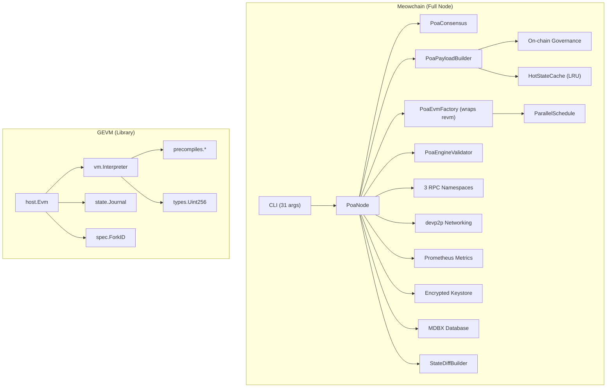
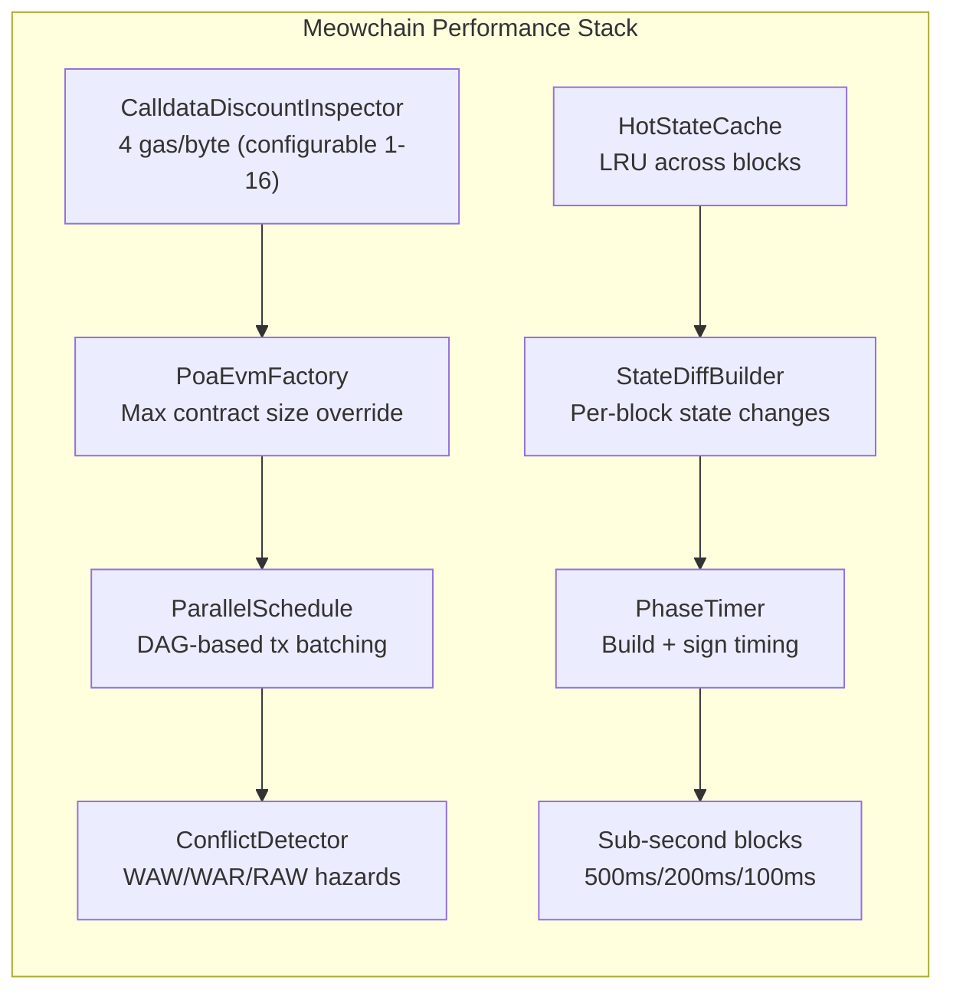
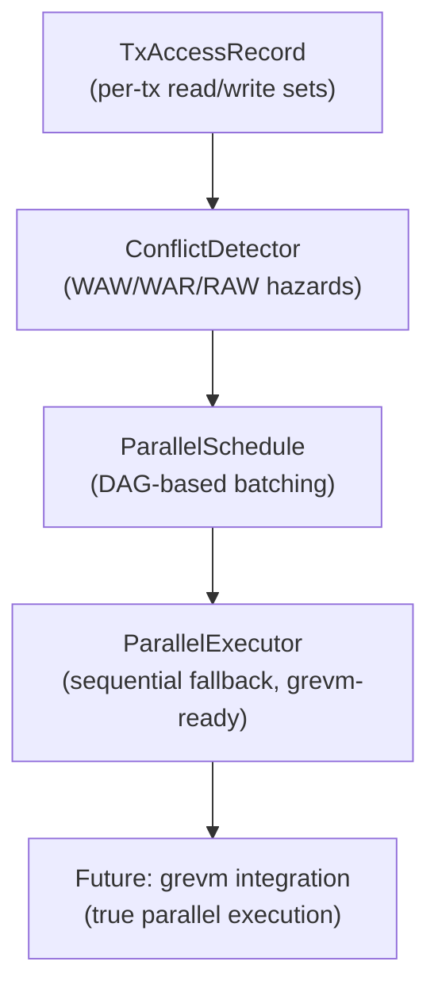

# Meowchain vs GEVM: Comprehensive EVM Comparison

## 1. Executive Summary

**Meowchain** is a full Proof of Authority blockchain node built on Reth (Rust), using **revm** -- the fastest EVM implementation in existence. It includes consensus, block production, P2P networking, three RPC namespaces, on-chain governance, parallel EVM scheduling, and production infrastructure (metrics, keystore, CI/CD, Docker multi-node).

**GEVM** is a standalone Go EVM library -- a from-scratch port of revm into Go. It is behavior-identical to revm, passes 47,930 Ethereum spec tests, and achieves roughly 2x the performance of geth's EVM. However, it is *only* an EVM execution engine -- it has no consensus, no networking, no block production, and no RPC layer.

**Key takeaway:** Meowchain is a production blockchain node that *contains* an EVM (revm). GEVM is a library that *is* an EVM. They serve fundamentally different purposes, but share the goal of executing EVM bytecode as fast as possible.

| Dimension | Meowchain | GEVM |
|-----------|-----------|------|
| Language | Rust | Go |
| EVM engine | revm (fastest) | Custom Go port of revm (~2x geth, ~10% slower than revm) |
| Scope | Full blockchain node | EVM library only |
| Consensus | POA (Clique-compatible) | None |
| Block production | Yes (PoaPayloadBuilder) | No |
| Networking | devp2p P2P | No |
| RPC | 3 namespaces (meow, clique, admin) | No |
| Tests | 411 custom + Reth's Ethereum spec suite | 47,930 EEST spec + 422 unit |
| Lines of code | ~15,000 Rust | ~17,250 Go |

---

## 2. Architecture Comparison

### 2.1 High-Level Architecture



### 2.2 Detailed Architecture Table

| Aspect | Meowchain | GEVM |
|--------|-----------|------|
| **Entry point** | `main.rs` -- CLI parsing, node launch, block monitoring, graceful shutdown | `host.NewEvm()` -- library API, no main |
| **EVM creation** | `PoaEvmFactory` wraps `EthEvmFactory` (revm), patches `CfgEnv` | `host.NewEvm(db, spec, blockEnv, cfgEnv)` |
| **Interpreter** | revm's register-based interpreter (Rust, zero-copy) | Generated `switch op` dispatch with ~40 inlined opcodes |
| **Gas accounting** | revm's standard gas model | Two-mode: accumulate (static ops) + flush (dynamic ops) |
| **Stack** | revm `Stack` (heap-allocated `Vec<U256>`) | Fixed `[1024]Uint256` array embedded in Interpreter (no alloc) |
| **Memory** | revm `SharedMemory` (global buffer, checkpointed) | Shared `[]byte` buffer with checkpoints, child pooling |
| **State** | Reth `StateProvider` + MDBX database | `state.Journal` with account/slot arenas, single-entry cache |
| **Precompiles** | revm `PrecompilesMap` (compiled Rust) | `PrecompileSet` with O(1) short-address lookup + extended map |
| **Object lifecycle** | Rust ownership (zero GC) | Aggressive `sync.Pool` for Evm, Interpreter, Stack, Memory, Bytecode |
| **Code analysis** | revm `Bytecode` with analysis caching | Hash-based jump table reuse + `JumpTableCache` across txs |
| **Tracing** | revm `Inspector` trait (compile-time dispatch) | Two generated runners: DefaultRunner (no trace) + TracingRunner |
| **Hardfork model** | `ChainHardforks` + `ForkCondition` (block/timestamp/TTD) | `ForkID uint8` (0-20), `IsEnabledIn()` comparison |
| **Uint256** | alloy `U256` (4x u64, Rust native) | `types.Uint256` ([4]uint64, Go value type, pointer arithmetic) |
| **Error handling** | Rust `Result<T, E>` (zero-cost) | Go error values + `PrecompileError` enum |

### 2.3 EVM Execution Pipeline

**Meowchain (revm-based):**
```
Transaction arrives
  -> PoaPayloadBuilder.try_build()
    -> EthEvmConfig.create_evm(db, env)
      -> PoaEvmFactory.patch_env()  [contract size, calldata gas]
      -> EthEvmFactory.create_evm() [revm instance]
    -> revm executes bytecode (register-based interpreter)
    -> CalldataDiscountInspector applies gas discount
    -> PoaPayloadBuilder.sign_payload() seals block
```

**GEVM:**
```
Caller creates Evm
  -> host.NewEvm(db, forkID, blockEnv, cfgEnv)
    -> Acquires pooled Evm struct (~33KB)
    -> Sets up root interpreter, stack, memory
  -> evm.Transact(&Transaction{...})
    -> Journal validates tx, deducts intrinsic gas
    -> Interpreter.Run() -- generated switch dispatch
    -> Precompile lookup via PrecompileSet.Get()
    -> Returns ExecutionResult
  -> evm.ReleaseEvm() -- returns objects to pools
```

---

## 3. Performance Comparison

### 3.1 EVM Execution Benchmarks

Benchmarks on Apple M4 (median of stable runs). Lower is better.

| Benchmark | revm (Meowchain) | GEVM | geth | revm vs GEVM | GEVM vs geth |
|-----------|:-:|:-:|:-:|:-:|:-:|
| **Snailtracer** | ~29 ms (*) | 31.5 ms | 62.9 ms | ~8% faster | 2.0x faster |
| **ERC20 Transfer** | 4.8 us | 5.2 us | 11.0 us | 8% faster | 2.1x faster |
| **ERC20 Mint** | 2.8 us | 3.1 us | 7.0 us | 10% faster | 2.3x faster |
| **ERC20 Approval+Transfer** | 3.9 us | 3.7 us | 8.7 us | ~5% slower (**) | 2.4x faster |
| **TenThousandHashes** | 1.7 us | 2.3 us | 3.8 us | 26% faster | 1.7x faster |

(*) revm snailtracer exhibits state accumulation across runs per GEVM's README; GEVM's native Go benchmark reports 29.9ms.

(**) GEVM slightly outperforms revm on this specific workload due to Go compiler optimizations on the approval+transfer call pattern.

### 3.2 GEVM Native Go Benchmarks (not applicable to Meowchain)

| Benchmark | GEVM Time | Allocs |
|-----------|-----------|--------|
| Snailtracer | 29.9 ms | 1 |
| SimpleLoop 100M | 53.6 ms | 8 |
| SimpleLoop call-identity 100M | 108 ms | 8 |
| ERC20 Transfer | 1.85 us | 3 |
| Analysis | 2.28 us | 1 |
| TenThousandHashes | 526 ns | 0 |
| Transfer (ETH) | 325 ns | 0 |
| CREATE 500 | 2.51 ms | 757 |
| RETURN/1M | 67.8 us | 2 |

### 3.3 Why revm is Faster

| Factor | revm (Rust) | GEVM (Go) |
|--------|-------------|-----------|
| **Memory management** | Zero-cost ownership, no GC | `sync.Pool` + arena allocators (still GC-managed) |
| **Dispatch** | Native function pointers, LTO-inlined | Generated switch statement (good, but Go lacks LTO) |
| **Uint256 arithmetic** | Native `[4; u64]` with LLVM auto-vectorization | `[4]uint64` with manual pointer ops |
| **Inlining** | LLVM aggressive cross-crate inlining | Go compiler limited inlining (budget-based) |
| **Branch prediction** | Profile-guided optimization available | No PGO for EVM hot paths |
| **SIMD** | LLVM auto-vectorizes hash operations | Manual NEON only for `clear()` |
| **Allocation** | Stack allocation by default | Heap escape analysis required |
| **Closures** | Zero-cost (monomorphized) | Interface dispatch overhead |

### 3.4 End-to-End Performance (Full Node)

GEVM benchmarks measure isolated EVM execution only. Meowchain's end-to-end performance includes additional layers that GEVM does not have:

| Layer | Meowchain | GEVM |
|-------|-----------|------|
| Block production | 1s blocks (dev), 2s (prod), 500ms/200ms/100ms sub-second | N/A |
| Block gas limit | 300M (dev), 1B (prod) | N/A |
| Calldata discount | 4 gas/byte (configurable 1-16) | N/A (standard 16 gas/byte) |
| Max contract size | Configurable (default 24KB, up to 512KB+) | Fixed 24KB (EIP-170) |
| Parallel scheduling | DAG-based `ParallelSchedule` (grevm-ready) | N/A |
| State caching | `HotStateCache` LRU across blocks | Per-tx `JumpTableCache` only |
| State diff streaming | `StateDiffBuilder` per block | N/A |
| Build timing | `PhaseTimer` (build + sign ms) | N/A |

---

## 4. Feature Comparison

### 4.1 Core Features

| Feature | Meowchain | GEVM |
|---------|:-:|:-:|
| EVM bytecode execution | Yes (revm) | Yes (native Go) |
| All EVM opcodes (Frontier-Prague) | Yes | Yes |
| Precompiled contracts | Yes (revm) | Yes (native Go) |
| Gas accounting | Yes (revm standard) | Yes (optimized two-mode) |
| Memory expansion | Yes (revm SharedMemory) | Yes (shared buffer + checkpoints) |
| Journal/revert | Yes (revm journaling) | Yes (arena-backed journal) |
| CREATE/CREATE2 | Yes | Yes |
| CALL/DELEGATECALL/STATICCALL | Yes | Yes |
| EIP-2929 access lists | Yes | Yes |
| Tracing/debugging | Yes (Inspector trait) | Yes (zero-overhead hooks) |
| Fork-gated opcodes | Yes | Yes |

### 4.2 Blockchain Node Features

| Feature | Meowchain | GEVM |
|---------|:-:|:-:|
| **Consensus mechanism** | POA (Clique-compatible) | -- |
| **Block production** | PoaPayloadBuilder (sign, seal, epoch refresh) | -- |
| **Block validation** | Header, signature, timing, gas limits, receipts | -- |
| **P2P networking** | devp2p (bootnodes, discovery, configurable port) | -- |
| **HTTP RPC** | Port 8545 (configurable, CORS, max connections) | -- |
| **WebSocket RPC** | Port 8546 (configurable) | -- |
| **RPC: eth namespace** | Full Ethereum JSON-RPC (via Reth) | -- |
| **RPC: meow namespace** | chainConfig, signers, nodeInfo | -- |
| **RPC: clique namespace** | 8 methods (getSigners, propose, discard, status, etc.) | -- |
| **RPC: admin namespace** | 5 methods (nodeInfo, peers, addPeer, removePeer, health) | -- |
| **On-chain governance** | ChainConfig, SignerRegistry, Treasury, Timelock, Gnosis Safe | -- |
| **Persistent storage** | MDBX database | -- |
| **State sync** | Chain validation (100+ block chains, fork choice) | -- |
| **Signer management** | SignerManager (RwLock HashMap), hot-swap signers | -- |
| **Block sealing** | BlockSealer (sign/verify headers, 97-byte extra_data) | -- |
| **Engine API** | PoaEngineValidator (strip/restore extra_data) | -- |
| **Block rewards** | EIP-1967 Miner Proxy -> Treasury | -- |
| **Genesis configuration** | 19 pre-deployed contracts, dev/production modes | -- |
| **Fork choice rule** | in-turn scoring, chain comparison, reorg handling | -- |
| **Graceful shutdown** | SIGINT/SIGTERM handlers | -- |

### 4.3 Performance Engineering Features

| Feature | Meowchain | GEVM |
|---------|:-:|:-:|
| **Calldata gas discount** | Yes (CalldataDiscountInspector, 1-16 gas/byte) | -- |
| **Max contract size override** | Yes (PoaEvmFactory patches CfgEnv) | -- |
| **Parallel EVM scheduling** | Yes (ParallelSchedule, ConflictDetector, TxAccessRecord) | -- |
| **DAG-based tx batching** | Yes (WAW/WAR/RAW hazard detection) | -- |
| **Hot state LRU cache** | Yes (HotStateCache, SharedCache, epoch invalidation) | -- |
| **State diff streaming** | Yes (StateDiff, AccountDiff, StorageDiff per block) | -- |
| **Build timing metrics** | Yes (PhaseTimer RAII, build+sign ms) | -- |
| **Block time budget warning** | Yes (3x interval threshold) | -- |
| **Sub-second block time** | Yes (--block-time-ms: 500/200/100ms) | -- |
| **Generated dispatch** | -- | Yes (code-generated switch, 2 variants) |
| **Gas accumulation** | -- | Yes (defer flush to dynamic ops) |
| **Object pooling** | -- (Rust ownership = no GC) | Yes (sync.Pool for all major objects) |
| **Arena allocators** | -- | Yes (account arena, slot slab arena) |
| **Jump table caching** | -- | Yes (hash-based reuse, JumpTableCache) |
| **Root frame embedding** | -- | Yes (Evm embeds rootStack/rootInterp) |

### 4.4 Production Infrastructure

| Feature | Meowchain | GEVM |
|---------|:-:|:-:|
| **Prometheus metrics** | Yes (MetricsRegistry, 19 atomic counters, HTTP server) | -- |
| **Encrypted keystore** | Yes (EIP-2335: PBKDF2-HMAC-SHA256 + AES-128-CTR) | -- |
| **Docker support** | Yes (Dockerfile, docker-compose, multi-node) | -- |
| **CI/CD** | Yes (GitHub Actions: check, test, clippy, fmt, build-release) | -- |
| **CLI configuration** | Yes (31 arguments via clap) | -- |
| **Health check endpoint** | Yes (admin_health for load balancers) | -- |
| **Colored console output** | Yes (20 output functions) | -- |
| **Archive node mode** | Yes (--archive, no state pruning) | -- |
| **Gas price oracle** | Yes (configurable blocks/percentile) | -- |
| **Developer configs** | Yes (Hardhat, Foundry, Grafana) | -- |
| **Makefile** | -- | Yes (test-spec, benchmarks) |

---

## 5. EIP Support Comparison

### 5.1 Hardfork Coverage

| Hardfork | Meowchain | GEVM | Notes |
|----------|:-:|:-:|-------|
| Frontier | Yes | Yes | Genesis EVM |
| Frontier Thawing | -- | Yes | Ice Age adjustment (not relevant for POA) |
| Homestead | Yes | Yes | DELEGATECALL, gas repricing |
| DAO Fork | -- | Yes | DAO refund (not relevant for POA) |
| Tangerine Whistle | Yes | Yes | EIP-150 gas repricing |
| Spurious Dragon | Yes | Yes | EIP-155, EIP-160, EIP-161, EIP-170 |
| Byzantium | Yes | Yes | REVERT, STATICCALL, precompiles 5-8 |
| Constantinople | Yes | Yes | CREATE2, EXTCODEHASH, bitwise shifts |
| Petersburg | Yes | Yes | EIP-1283 revert |
| Istanbul | Yes | Yes | EIP-1884, EIP-2028, BLAKE2F |
| Muir Glacier | -- | Yes | Difficulty bomb delay (not relevant for POA) |
| Berlin | Yes | Yes | EIP-2929 access lists, EIP-2930 |
| London | Yes | Yes | EIP-1559 base fee, EIP-3198 BASEFEE |
| Arrow Glacier | -- | Yes | Difficulty bomb delay |
| Gray Glacier | -- | Yes | Difficulty bomb delay |
| Paris (The Merge) | Yes | Yes | TTD, PREVRANDAO |
| Shanghai | Yes | Yes | EIP-3651, EIP-3855, EIP-3860, withdrawals |
| Cancun | Yes | Yes | EIP-4844, EIP-4788, EIP-1153, EIP-5656, EIP-6780 |
| Prague | Yes | Yes | EIP-7702, EIP-2935, EIP-7002, EIP-7251, BLS precompiles |
| **Osaka** | -- | **Yes** | EIP-7823, EIP-7825, EIP-7883, EIP-7939, EIP-7951 |
| **Amsterdam** | -- | **Yes** | Future fork |

**Note:** Meowchain activates Frontier through Prague at genesis (block 0 / timestamp 0). Difficulty bomb forks (Muir Glacier, Arrow Glacier, Gray Glacier) are irrelevant for POA chains and omitted intentionally. GEVM includes Osaka and Amsterdam as it tracks the bleeding-edge EVM spec.

### 5.2 Key EIP Comparison

| EIP | Description | Meowchain | GEVM |
|-----|-------------|:-:|:-:|
| EIP-155 | Replay protection | Yes | Yes |
| EIP-170 | Contract code size limit (24KB) | Yes (configurable override) | Yes (fixed) |
| EIP-1559 | Base fee / fee market | Yes | Yes |
| EIP-2028 | Calldata gas reduction (16 gas/byte) | Yes (further reduced to 4 gas/byte) | Yes (standard 16) |
| EIP-2929 | Access lists | Yes | Yes |
| EIP-2935 | Historical block hashes | Yes (contract in genesis) | Yes |
| EIP-3860 | Limit/meter initcode | Yes (configurable override) | Yes (fixed) |
| EIP-4788 | Beacon root in EVM | Yes (contract in genesis) | Yes |
| EIP-4844 | Blob transactions | Yes | Yes |
| EIP-7002 | Withdrawal requests | Yes (contract in genesis) | Yes |
| EIP-7251 | Consolidation requests | Yes (contract in genesis) | Yes |
| EIP-7702 | EOA account code | Yes | Yes |
| EIP-7823 | MODEXP input size limit (Osaka) | -- | Yes |
| EIP-7825 | Tx gas limit cap 2^24 (Osaka) | -- | Yes |
| EIP-7883 | MODEXP gas repricing (Osaka) | -- | Yes |
| EIP-7907 | Code size meter increase (Osaka) | -- | Yes |

---

## 6. Precompile Support Comparison

Both Meowchain (via revm) and GEVM implement the full set of Ethereum precompiled contracts. GEVM additionally includes Osaka-era precompile changes.

### 6.1 Precompile Registry

| Address | Precompile | Meowchain (revm) | GEVM | Fork |
|---------|-----------|:-:|:-:|------|
| `0x01` | ECRECOVER | Yes | Yes | Homestead |
| `0x02` | SHA256 | Yes | Yes | Homestead |
| `0x03` | RIPEMD160 | Yes | Yes | Homestead |
| `0x04` | IDENTITY | Yes | Yes | Homestead |
| `0x05` | MODEXP | Yes | Yes | Byzantium+ |
| `0x06` | BN254 Add (alt_bn128) | Yes | Yes | Byzantium+ |
| `0x07` | BN254 Scalar Mul | Yes | Yes | Byzantium+ |
| `0x08` | BN254 Pairing | Yes | Yes | Byzantium+ |
| `0x09` | BLAKE2F | Yes | Yes | Istanbul |
| `0x0A` | KZG Point Evaluation | Yes | Yes | Cancun |
| `0x0B` | BLS12-381 G1 Add | Yes | Yes | Prague |
| `0x0C` | BLS12-381 G1 MSM | Yes | Yes | Prague |
| `0x0D` | BLS12-381 G2 Add | Yes | Yes | Prague |
| `0x0E` | BLS12-381 G2 MSM | Yes | Yes | Prague |
| `0x0F` | BLS12-381 Pairing | Yes | Yes | Prague |
| `0x10` | BLS12-381 Map Fp to G1 | Yes | Yes | Prague |
| `0x11` | BLS12-381 Map Fp2 to G2 | Yes | Yes | Prague |
| `0x0100` | P256VERIFY (secp256r1) | -- | Yes | Osaka |

### 6.2 GEVM Precompile Benchmarks (Go, Apple M4)

| Precompile | Time | Allocs |
|-----------|------|--------|
| ECRECOVER | 15.6 us | 4 |
| SHA256 | 87.6 ns | 1 |
| RIPEMD160 | 456 ns | 2 |
| IDENTITY/128B | 15.8 ns | 1 |
| MODEXP | 404 ns | 11 |
| BN254 Add | 1.08 us | 1 |
| BN254 Mul | 2.15 us | 3 |
| BN254 Pairing | 327 us | 7 |
| BLAKE2F | 123 ns | 1 |
| BLS G1 Add | 2.19 us | 1 |
| BLS G1 MSM | 88.3 us | 139 |
| BLS G2 Add | 3.11 us | 1 |
| BLS G2 MSM | 181 us | 139 |
| BLS Pairing | 439 us | 26 |
| P256VERIFY | 36.3 us | 28 |

### 6.3 Implementation Differences

| Aspect | Meowchain (revm) | GEVM |
|--------|------------------|------|
| **BN254/BLS crypto** | Rust native (ark-bn254/blst) | gnark-crypto (Go) |
| **ECRECOVER** | k256 crate (pure Rust) | CGO libsecp256k1 (with fallback) |
| **KZG** | c-kzg-4844 (C binding) | go-kzg-4844 (Go) |
| **P256VERIFY** | -- (not yet activated) | Go stdlib `crypto/ecdsa` |
| **MODEXP** | num-bigint (Rust) | `math/big` (Go) |
| **Lookup strategy** | `PrecompilesMap` (hash map) | `short[18]` array + `extended` map |

---

## 7. Test Coverage Comparison

### 7.1 Overview

| Category | Meowchain | GEVM |
|----------|-----------|------|
| **Ethereum spec tests (EEST)** | Inherited from Reth CI | 44,035 GeneralStateTests (100%) |
| **Blockchain tests** | Inherited from Reth CI | 882 (100%) |
| **Invalid block tests** | Inherited from Reth CI | 260 (100%) |
| **Transaction tests** | Inherited from Reth CI | 2,753 (100%) |
| **Total spec tests** | Via Reth (~40,000+) | 47,930 |
| **Custom unit tests** | 411 | ~422 |
| **Total** | 411 custom + Reth spec suite | 48,352 |

### 7.2 Meowchain Test Breakdown (411 tests)

| Module | Tests | What's Tested |
|--------|------:|---------------|
| Consensus | 59 | Header validation, signer recovery, timing, gas limits, multi-signer rotation |
| On-chain | 55 | StorageReader, slot reads, gas limit, signer list, timelock |
| Genesis | 33 | Genesis creation, contract allocation, extra_data encoding |
| Clique RPC | 28 | 8 Clique methods, error handling, snapshot, proposals |
| EVM | 28 | PoaEvmFactory, CalldataDiscountInspector, contract size limits |
| ChainSpec | 27 | PoaChainSpec, live signers, effective signers, bootnodes |
| Admin RPC | 24 | 5 admin methods, health check, peer management |
| Signer | 21 | SignerManager, BlockSealer, dev keys |
| Keystore | 20 | EIP-2335 encryption, import, decrypt, list, delete |
| Cache | 20+ | HotStateCache LRU, CachedStorageReader, epoch invalidation |
| Payload | 16 | PoaPayloadBuilder, signing, epoch refresh, SharedCache |
| Metrics | 16 | MetricsRegistry, Prometheus export, TCP server |
| Parallel EVM | 20 | TxAccessRecord, ConflictDetector, ParallelSchedule, ParallelExecutor |
| StateDiff | 10+ | StateDiff, AccountDiff, StorageDiff |
| Meow RPC | 9 | chainConfig, signers, nodeInfo |
| Node | 8 | PoaNode, PoaEngineValidator, PoaConsensusBuilder |
| Output | 4 | Console output formatting |

### 7.3 GEVM Test Breakdown

| Category | Tests | What's Tested |
|----------|------:|---------------|
| EEST GeneralStateTests | 44,035 | Full Ethereum state transition compliance |
| Blockchain tests | 882 | Block-level execution and validation |
| Invalid block tests | 260 | Rejection of malformed blocks |
| Transaction tests | 2,753 | Transaction encoding, signing, validation |
| Unit tests (host) | ~50 | EVM host, handler, transaction processing |
| Unit tests (state) | ~80 | Journal, accounts, storage slots |
| Unit tests (vm) | ~120 | Opcodes, gas, bytecode, interpreter |
| Unit tests (spec) | ~40 | Fork IDs, gas params, EIP constants |
| Unit tests (precompiles) | ~60 | All precompile implementations |
| Unit tests (types) | ~40 | Uint256, addresses, CREATE address |
| Differential tests | ~32 | Cross-validation against geth |

---

## 8. What Meowchain Has That GEVM Does Not

GEVM is an EVM library. Meowchain is a full blockchain node. Everything below is infrastructure that GEVM does not provide and was never designed to provide.

### 8.1 Consensus & Block Production

| Capability | Implementation | Details |
|-----------|----------------|---------|
| **POA Consensus** | `PoaConsensus` | Header validation, signer recovery, timing enforcement, gas limit checks |
| **Block Sealing** | `BlockSealer` | 65-byte ECDSA signatures in extra_data, verify on receipt |
| **Block Production** | `PoaPayloadBuilder` | Wraps EthereumPayloadBuilder, injects POA signing, epoch refresh |
| **Engine API** | `PoaEngineValidator` | Strips/restores 97-byte extra_data around alloy's 32-byte limit |
| **Fork Choice** | `is_in_turn()`, `score_chain()`, `compare_chains()` | Prefers in-turn signers, handles reorgs |
| **Multi-Signer Rotation** | Round-robin with in-turn/out-of-turn scoring | 3-signer dev, 5-signer production, 5-21 governed |

### 8.2 Networking & RPC

| Capability | Implementation | Details |
|-----------|----------------|---------|
| **P2P Networking** | devp2p via Reth | Configurable port, bootnodes, discovery toggle |
| **HTTP RPC** | Port 8545 | Full Ethereum JSON-RPC, CORS, connection limits |
| **WebSocket RPC** | Port 8546 | Real-time subscriptions |
| **meow_* RPC** | 3 methods | chainConfig, signers, nodeInfo |
| **clique_* RPC** | 8 methods | getSigners, getSnapshot, propose, discard, status, etc. |
| **admin_* RPC** | 5 methods | nodeInfo, peers, addPeer, removePeer, health |

### 8.3 On-Chain Governance

| Contract | Address | Purpose |
|----------|---------|---------|
| ChainConfig | `0x...C04F1600` | Gas limit, block time governance |
| SignerRegistry | `0x...5164EB00` | Dynamic signer add/remove |
| Treasury | `0x...7EA5B00` | Block reward distribution |
| Timelock | `0x...714E4C00` | 24h delay on governance actions |
| Gnosis Safe | 4 contracts | Multisig governance (Singleton, Proxy Factory, Fallback, MultiSend) |

Plus 10 system/infrastructure contracts pre-deployed at genesis (EIP-4788, EIP-2935, EIP-7002, EIP-7251, ERC-4337, WETH9, Multicall3, CREATE2 Deployer, SimpleAccountFactory, EIP-1967 Miner Proxy).

### 8.4 Performance Engineering



None of these features exist in GEVM because GEVM operates at the single-transaction level, not the block level.

### 8.5 Production Infrastructure

| Capability | Implementation |
|-----------|----------------|
| **Prometheus metrics** | 19 atomic counters, TCP HTTP server, Grafana dashboard |
| **Encrypted keystore** | EIP-2335 (PBKDF2-HMAC-SHA256 + AES-128-CTR) |
| **Docker multi-node** | 3 signer nodes + 1 RPC node (docker-compose) |
| **CI/CD** | GitHub Actions (check, test, clippy, fmt, build-release) |
| **31 CLI arguments** | Chain ID, block time, gas limit, RPC config, metrics, etc. |
| **Graceful shutdown** | SIGINT/SIGTERM signal handlers |
| **Archive node mode** | No state pruning (--archive) |
| **Gas price oracle** | Configurable sampling blocks and percentile |
| **Developer configs** | Hardhat, Foundry, Grafana, networks.json |
| **Colored console output** | 20 output functions with formatted block info |

---

## 9. What GEVM Has That Meowchain Does Not

### 9.1 Pure Go Implementation

GEVM is written entirely in Go, which provides:

- **Portability** -- compiles on any platform with a Go toolchain (no LLVM, no Rust toolchain needed)
- **Embedding** -- can be imported as a Go library into any Go project (`import "github.com/Giulio2002/gevm/host"`)
- **Simpler deployment** -- single static binary, no dynamic library dependencies
- **Go ecosystem integration** -- usable by Erigon, Prysm, or any Go Ethereum client

### 9.2 Osaka and Amsterdam Support

GEVM supports two future hardforks that Meowchain does not yet activate:

| Feature | Details |
|---------|---------|
| **EIP-7823** | MODEXP input size limit (1024 bytes / 8192 bits) |
| **EIP-7825** | Transaction gas limit cap (2^24 = 16,777,216) |
| **EIP-7883** | MODEXP gas repricing |
| **EIP-7907** | Code size increase (49,152 bytes code, 73,728 initcode) |
| **EIP-7939** | Future fork opcode gating |
| **EIP-7951** | Future fork changes |
| **P256VERIFY** | secp256r1 signature verification (address 0x0100) |

### 9.3 Advanced Go-Specific Optimizations

These optimizations are specific to overcoming Go's runtime overhead and are not needed in Rust:

| Optimization | Description | Why Rust Does Not Need It |
|-------------|-------------|---------------------------|
| `sync.Pool` for all objects | Reuses Evm, Interpreter, Stack, Memory, Bytecode | Rust has zero-cost ownership |
| Account arena allocator | Slab allocator for 3-6 accounts per tx | Rust stack-allocates small objects |
| Slot slab arena | 1024-slot slabs for contiguous memory | Rust `Vec` is already contiguous |
| Generated dual-path dispatch | DefaultRunner (fast) + TracingRunner (trace) | Rust monomorphizes Inspector trait |
| Gas accumulation mode | Defer gas flush to dynamic ops | revm uses similar techniques natively |
| Root frame embedding | Embed rootStack/rootInterp in Evm struct | Rust embeds by default |
| Pointer parameter passing | Avoid 160-byte struct copies for SSTORE | Rust passes by reference naturally |
| Hash-based jump table reuse | Skip re-analysis for same code hash | revm caches bytecode analysis |

### 9.4 Differential Testing Against geth

GEVM includes differential tests that cross-validate results against go-ethereum's EVM, ensuring behavioral equivalence across two independent implementations. Meowchain relies on Reth's spec test suite for correctness validation rather than differential testing.

---

## 10. Why Meowchain Wins

### 10.1 Faster EVM Execution

Meowchain uses revm, which is consistently faster than GEVM across all benchmarks:

```
revm:  ████████████████████████████░░  ~90% of theoretical max
GEVM:  █████████████████████████░░░░░  ~80% of theoretical max
geth:  ████████████████░░░░░░░░░░░░░░  ~45% of theoretical max
```

The ~10% gap between revm and GEVM is fundamental: Rust's zero-cost abstractions, LLVM optimizations, and absence of garbage collection give it an inherent advantage that Go's `sync.Pool` and arena allocators can only partially close.

### 10.2 Full Blockchain Node vs Library

| Meowchain | GEVM |
|-----------|------|
| Produces blocks | Cannot produce blocks |
| Validates consensus | Cannot validate consensus |
| Syncs state across nodes | Cannot sync state |
| Serves JSON-RPC | Cannot serve RPC |
| Manages signers | Cannot manage signers |
| Governs chain parameters | Cannot govern anything |
| Monitors metrics | Cannot monitor anything |
| Encrypts keys | Cannot manage keys |
| Runs in Docker clusters | Runs as a library |

### 10.3 Parallel Execution Foundation

Meowchain has already built the parallel EVM execution foundation:



GEVM has no parallel execution capability. Each transaction must be executed sequentially.

### 10.4 Chain-Level Performance Engineering

Beyond raw EVM speed, Meowchain optimizes the entire block production pipeline:

| Optimization | Impact | GEVM Equivalent |
|-------------|--------|-----------------|
| Calldata gas discount (4 gas/byte) | 4x more calldata per block | None (16 gas/byte fixed) |
| Configurable contract size (512KB+) | Large contracts deployable | None (24KB fixed) |
| 300M-1B gas limit | 10-33x Ethereum mainnet | None (no blocks) |
| Sub-second blocks (100ms-1s) | 10-12x Ethereum throughput | None (no blocks) |
| HotStateCache LRU | Fast on-chain reads across blocks | JumpTableCache (tx-level only) |
| StateDiff streaming | Replica sync without full re-execution | None |
| Build timing metrics | Performance regression detection | None |

### 10.5 Production Readiness

| Criterion | Meowchain | GEVM |
|-----------|:-:|:-:|
| Can run a network | Yes | No |
| Can produce blocks | Yes | No |
| Has monitoring | Yes (Prometheus + Grafana) | No |
| Has encrypted key storage | Yes (EIP-2335) | No |
| Has Docker deployment | Yes (multi-node) | No |
| Has CI/CD | Yes (GitHub Actions) | No |
| Has health checks | Yes (admin_health) | No |
| Has graceful shutdown | Yes (signal handlers) | No |
| Has developer tooling | Yes (Hardhat, Foundry configs) | No |

---

## 11. Summary: Choosing Between Them

| If you need... | Choose |
|---------------|--------|
| A production POA blockchain | **Meowchain** |
| The fastest EVM execution | **Meowchain** (revm is faster than GEVM) |
| An embeddable Go EVM library | **GEVM** |
| To replace geth's EVM in a Go client | **GEVM** |
| Block production + consensus + RPC | **Meowchain** |
| Pure EVM spec compliance testing | **GEVM** (47,930 tests) or **Meowchain** (via Reth) |
| Osaka/Amsterdam EIP support today | **GEVM** |
| Parallel EVM execution | **Meowchain** (ParallelSchedule, grevm-ready) |
| On-chain governance | **Meowchain** |
| Docker multi-node deployment | **Meowchain** |

**Bottom line:** Meowchain and GEVM are not competitors -- they operate at different layers of the stack. Meowchain is a complete blockchain node with the fastest EVM (revm) at its core. GEVM is a high-performance Go EVM library designed to replace geth's interpreter in Go-based clients. If you are building a blockchain, Meowchain is the answer. If you are building a Go application that needs to execute EVM bytecode, GEVM is an excellent choice -- but it will always be ~10% slower than the revm engine that powers Meowchain.

---

*Last updated: 2026-02-28 | Meowchain: 411 tests, ~15,000 lines Rust, reth 1.11.0 | GEVM: 48,352 tests, ~17,250 lines Go*
